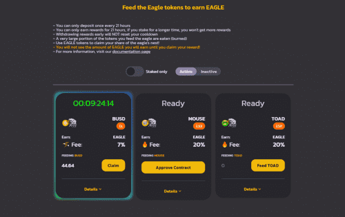

# Eagle.Farm

Eagle Farm 的概念是独一无二的，它是一个收益农场，不为任何去中心化交易所 (DEX) 提供流动性，因为这就是 Mouse.Farm 和 Toad.Farm 服务的目的。
相反，这个收益农场的目的是成为 Mouse 和 Toad 代币的“代币接收器”。它作为一种自动销毁机制来减少流通代币的数量，从而增加其价值并为投资者提供激励，为去中心化交易所（DEX）提供流动性。

鹰农场赛马场成立于 1865 年，它的赛车起源于早期的定居点，第一批定居者前往赛道享受平底船的乐趣。 150 多年来，Eagle Farm Racecourse 举办了大洋洲最优秀的纯种马，并迎来了成千上万的参赛者。

迷人的场地拥有保存完好的维多利亚时代和联邦遗产建筑、庄严的锻铁和木材看台、修复的投注礼堂和华丽的铁门和柱子。该场地拥有世界一流的设施和超过 35 个功能空间，我们最受欢迎的地方是 Guias Room、Tote Room 和 Society Rooftop。

企业、时尚人士、赛车爱好者和社交客人可以享受提供的众多娱乐选择。来吧，享受雷鸣般的马蹄声、赛车时尚的魅力以及比赛日的热情好客和放纵。

