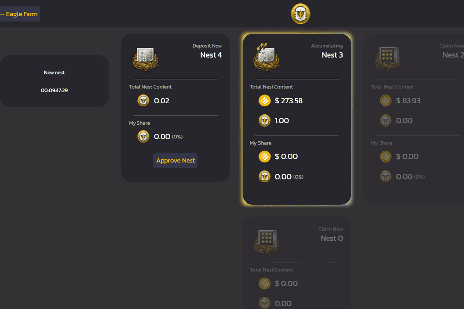

# Eaglenest.Finance

Farmhub 生态系统目前由三个农场组成；两个养殖场，一个饲养场。
TOAD 和 MOUSE 代币可以通过为去中心化交易所（DEX）提供流动性来获得。
流动性提供者将获得这些代币奖励，这些代币可以馈送到 Eagle.Farm 上的 Eagle。
每个质押会话有 21 小时的时间限制，这需要用户每天取消质押和重新质押资金。
取消抵押后，用户以 EAGLE 代币的形式领取奖励。然后可以将它们存放到鹰巢中。
Eagle's Nest 充斥着 BUSD（源自交易费）。
当一个新的巢穴打开时，积累的巢穴将允许其利益相关者以 BUSD 的形式索取他们的奖励。

