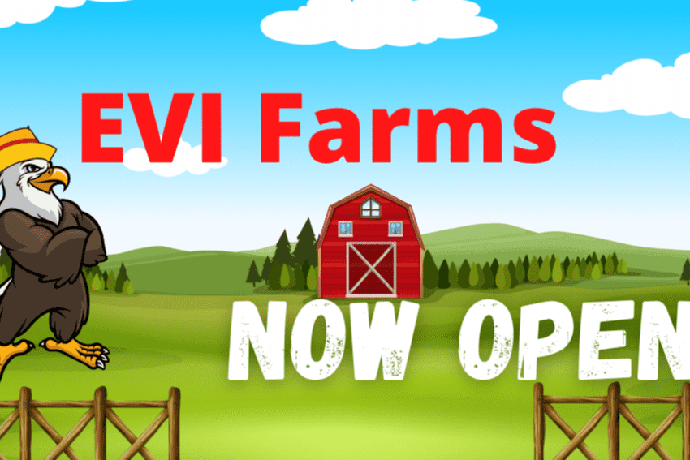

# EagleSwap

Eagle Vision ADA，桥接 BSC-ADA 的 DeFi 应用程序的完整生态系统。由智能合约支持的数字应用程序的多链和跨链解决方案 BSC-ADA DEX (EagleSwap) 多链孵化器，Launchpad 将新的 ADA 项目带入生活。娱乐 Dapps、Staking Vault 和多链 Eagle 钱包。用于构建部署和赚取的开发人员门户。币安智能链桥接 BSC-ADA 上的 AMM +Yield 聚合器

嗨，我有一个完成的 pcb，但我有一个问题。它只有两层（顶部和底部），但它们以错误的方式旋转，即顶层应该是底层，反之亦然。有没有简单的方法来改变这个？这是因为顶部有表面贴装焊盘，而它们应该在底部。我是新手，所以请耐心等待。谢谢...

币安智能链上的 AMM +Yield 聚合器。通过收益赚取EVI，然后将其质押在Pools中以赚取

