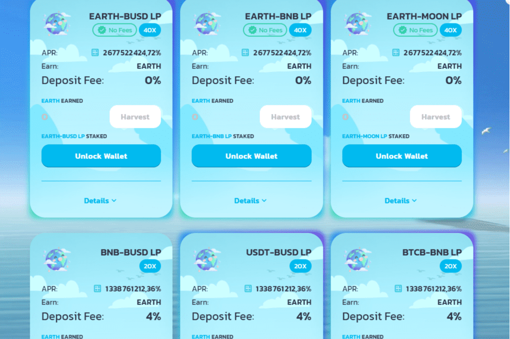

# Earth Farm

#BSC 上的自动流动性收购收益农场和 AMM 具有独特的通货紧缩机制
🌍月亮农场二层🌍作为社区支持农业 (CSA) 农场成立于 1995 年，我们相信种植有营养（和美味！）水果和蔬菜的关键是创造和培育健康的土壤。为此，我们使用堆肥、轮作、覆盖作物和覆盖、添加有机土壤改良剂以及遵循仔细耕作等技术来模拟自然土壤建设过程。这些技术使我们能够在不消耗食物的情况下种植和收获食物，而是滋养土壤及其自然生命周期。作为土地的管理者，我们进行有机耕作。

