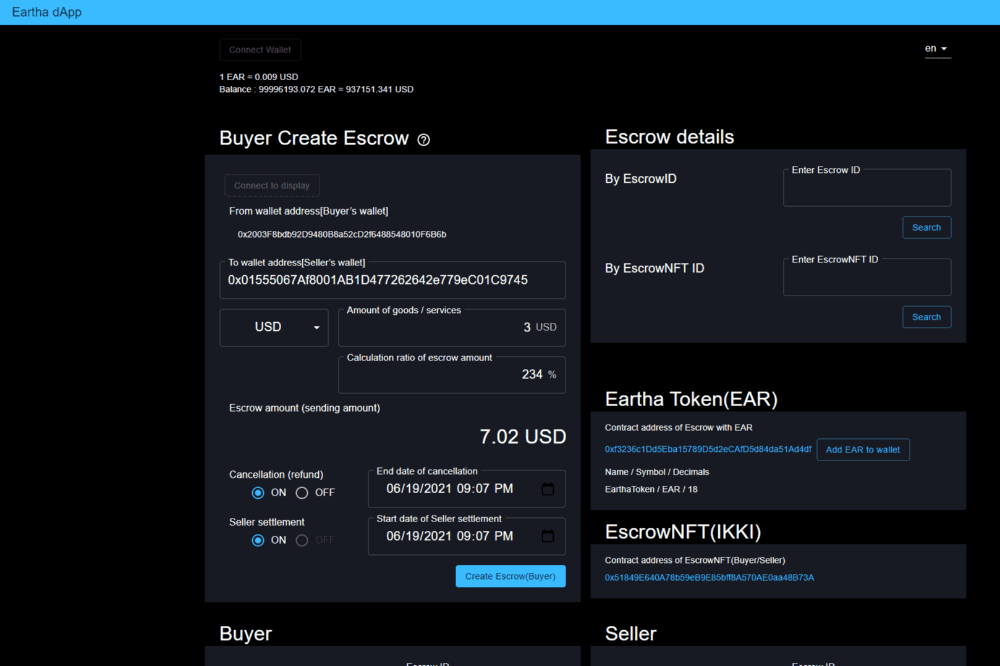

# Eartha

Eartha dApp 是一个 DeFi dApp，它允许任何人使用为 B2B 交易创建的特殊 DeFi 代币“Eartha Token(EAR)”轻松发送以法定货币为基础的代币，例如欧元、日元、美元等。
任何人都可以在世界任何地方使用和发送 EAR。

  Eartha dApp发送的代币是Eartha Token (EAR)，需要BNB作为gas费。
  收件人将收到一个 Eartha 令牌 (EAR)。
  在使用 Eartha dApp 之前，用户的钱包中需要有 EAR 和 BNB（gas 费）。
  在 EAR 预算用完之前，Eartha dApp 用户将获得与其 gas 费 (BNB) 一样多的 EAR，作为“托管激励”。因此，用户可以发送 EAR 几乎没有 Gas 费（BNB）。

有关详细信息，请参阅“eartha.org”和 Eartha 项目的白皮书。

