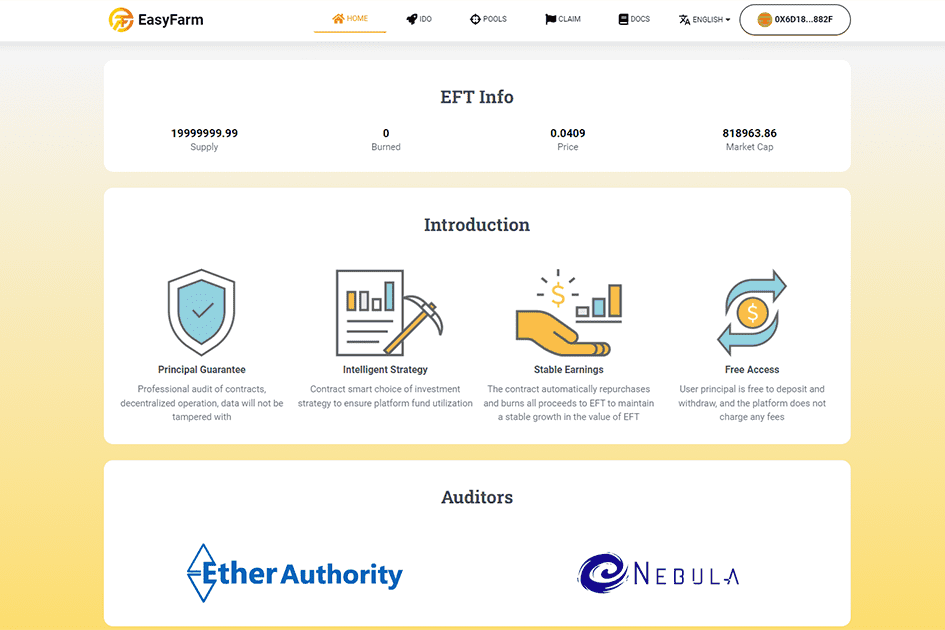

# EasyFarm

EasyFarm 是一个自动化的收入聚合平台。目的是为了让 DeFi 用户更容易挖矿，获得更高的收益。用户只需将资金存入协议即可挖矿，所有收益都会以EasyFarmToken（EFT）的形式奖励给用户，让用户无需兑换繁琐的代币，同时可以更多的计算挖矿收益简单地。我们将广泛评估市场上安全稳定的DeFi协议，为用户选择最佳协议进行挖矿，并通过智能合约自动回购EFT并直接销毁挖矿产生的所有收益，从而保护平台币的价值电子转帐增加。

