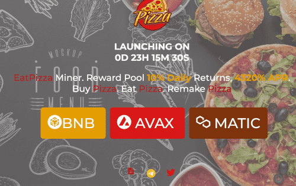

# Eat Pizza Miner

高达 10% 的每日回报 |吃披萨 | 4320% 年利率 | BSC |AVAX|MATIC| 14% 推荐 什么是 EAT PIZZA？
EatPizza Miner 是基于 Binance (BSC)|SnowTrace|Polygon 的智能链，费用相同但回报率更高（高达 10%），这意味着您可以更快地获得投资回报
EatPizza 智能合约基本上是一个锁定的质押奖励池，存入的资金在 dApp 上转换为“Pizza”并表示为“Pizza”。该项目每天将支付您高达 10% 的投资。
您选择是否：
• “吃披萨”——每天领取您的奖励
• “重做”— 复合您的投资。
他们在智能合约中内置了一个很好的机制，你会因为过于频繁地取款而受到惩罚，并会因为复合/再投资你的日常奖励而受到激励。
您的每日奖励率每天高达 10%，但如果您提款过于频繁，则会降低，因此白皮书中建议每周遵循 6 天的 Re-Roast 1 Day Eat Cycle，以延长协议的寿命和您自己的奖励率。
请注意，如果合约中的锁定总价值 (TVL) 下降，这个奖励百分比也可能下降到 2-3%。迄今为止，合约的TVL仅在增加，奖励稳定在每天10%（根据用户的提现习惯可能会减少）
税费
对用于开发和营销的存款和销售征收 2.5% 的税。具体分布不详。

