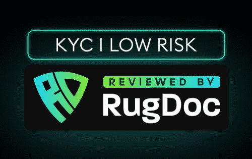

# EbiSwap Finance

EbiSwap 是基于 Polygon 网络的下一代高价值农业协议。在 Rugdoc.io 上进行 KYC 验证。通过我们精心策划的代币经济学，EbiSwap 旨在成为一种以价值为导向且经济可持续的分层收益农场模式。
该项目的目标是为我们的社区提供长期可持续性和机会，以最大限度地提高现有资产的收益。 发展迅猛，已发展成为以太坊扩容的常用解决方案，其网络围绕 ZK 技术展开，在推进开发的同时积极收购其他使用 ZK 的 Layer 2 网络

