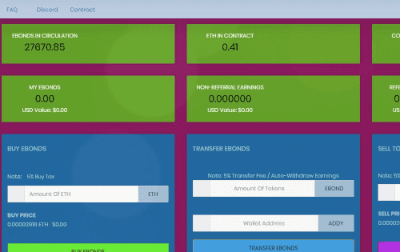

# EBONDS

使用 ETH 国库债券 (EBOND) 赚取 - 安全 - 稳定收益 -ERC-20 代币 5% 买卖税，eBonds 是一家住宅债券发起公司，在债券发起方面拥有必要的主动性和专业知识，以应对南非不断增长的住宅贷款市场，并为金融机构和潜在的购房者提供值得信赖的房地产融资服务。

使用 EE 债券

节省可靠、低风险、政府支持的产品
补充您的退休收入
作为礼物赠送（请参阅：赠送储蓄债券作为礼物）
支付教育费用（请参阅：使用 EE 或 I 债券进行教育）
√ 一目了然
什么是EE债券？
（自 2005 年 5 月起发行的 EE 债券）我们今天出售的 EE 债券可在长达 30 年的时间内获得相同的利率（固定利率）。当您购买债券时，您知道它至少在前 20 年的收益率是多少。财政部每年 5 月 1 日和 11 月 1 日都会公布新债券的利率。

请参阅：将 I 债券与 EE 债券进行比较
旧的 EE 债券有什么不同吗？是的。从 1997 年 5 月到 2005 年 4 月购买的 EE 债券的利率每六个月变化一次（可变利率）。 1997 年 5 月之前购买的 EE 债券根据购买时间以不同的利率赚取利息。

了解有关利率的更多信息 - 当前和过去
如果我现在购买 EE 债券，它将获得什么利息？从 2022 年 5 月到 2022 年 10 月购买的债券的年利率为 0.10%。无论利率如何，20 年期债券的价值将是您支付的两倍。如果您保持债券那么久，我们会进行一次性调整以履行此保证。

了解有关利率的更多信息 - 当前和过去

