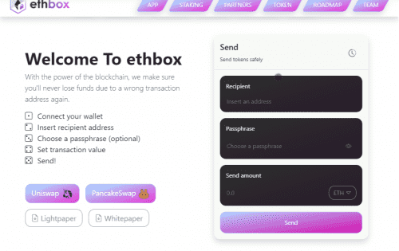

# ebox

如果出现任何问题，ebox 为用户提供了撤销交易的可能性 - 通过提供基于智能合约的托管服务，用户可以随时取消传出交易，如果出现任何问题（错误输入/错误复制的收件人地址，也发送很多，等等）。
此外，用户可以进行 100% DeFi 场外交易（OTC）。使用 ebox，两方可以简单地相互发送和请求 ETH/BNB/MATIC/REEF/MOVR 和 ERC-20 代币（即将推出：NFT 支持！），从而实现完全无需信任的交易，就在链上，无需任何中介.
使用 ebox 的每个人也受益于隐私的增加，因为通过 ebox 智能合约进行的任何交易本质上都是模糊的。随着额外的隐私功能和即将到来的部分支付，任何第三方几乎不可能确定谁通过 ebox 发送了多少资金。

