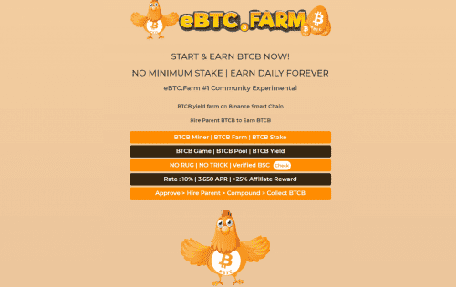

# eBTC Farm

聘请父母 Btcb 每天赚取 Btcb +10%
母公司 Btcb 每天支付适度的 10%，让投资者高枕无忧，因为他们知道他们的投资具有无限的增长潜力和最大值。
可持续性
什么是 E 系列债券？
E系列债券最初是为了资助美国参与二战。它们以低于面值的价格出售，并在到期时支付全部面值。 E 系列债券在战后作为美国储蓄债券仍然可用，并在 1980 年被 EE 系列储蓄债券取代，也称为“爱国者债券”。

E 系列债券，于 1941 年 5 月首次作为国防债券发行。 E 系列债券的第一个购买者是富兰克林·D·罗斯福总统。从 1935 年到 1941 年，A 至 D 系列储蓄债券发行。当年 12 月美国对日本宣战后，E 系列成为“战争债券”。

