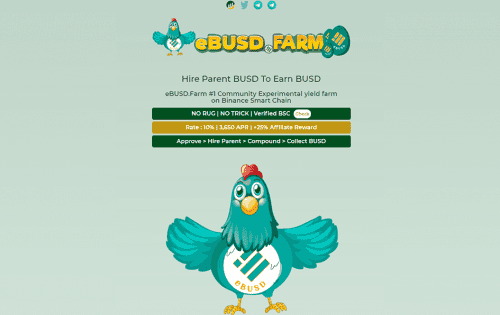

# eBUSD Farm

可持续性
母公司 BUSD 每天支付 10% 的适度费用，让投资者高枕无忧，因为他们知道他们的投资具有无限的增长潜力和最大的、不可能的风险低于 10%。
已验证的公共合同
eBUSD 合约是公开的、经过验证的，可以在 BSCSCAN 上查看。
eBUSD.农场空头
母公司 BUSD 每天支付 10%，根据当前的挖矿效率。挖矿效率随着你和其他玩家“雇用父母BUSD，雇用更多父母和收集BUSD”而上升和下降。
游戏的目标是比其他玩家更快、更频繁地雇佣更多的父母。这反过来又可以更快地为您赚取更多的 BUSD。使用您的每日 BUSD 收入雇用更多的家长将在 30 天或更短的时间内使您的矿工增加 10 倍。
eBUSD.农场说明
批准 BUSD 支出 > 雇用母公司 BUSD > 母公司铸币厂 BUSD > 每日复合 > 提款 > 利润！
选择您要花费多少 BUSD，然后单击“批准花费”。
使用 BUSD 的“雇用父母 BUSD”。
您的 PARENT BUSD 将开始生成 BUSD，将他们找到的 BUSD 存入您的账户。
您可以使用“雇用更多家长”按钮来复合您的收入。这会使用您账户中的 BUSD 来提高您的 BUSD 农业生产率。
或者，您可以使用“领取您的 BUSD”按钮提取您账户中的 BUSD，您的父母 BUSD 将再次开始充值您的账户。
母公司 BUSD 将在长达 24 小时内不间断地向您的账户充值 BUSD。 24 小时后，您的账户将满并可能开始溢出，直到您通过雇佣更多家长或收集它来使用您账户中的 BUSD。您可以随时聘请更多家长或领取您的 BUSD，但建议至少每 24 小时这样做一次。

