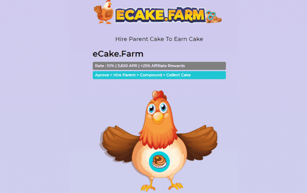

# eCake Farm

雇佣父母蛋糕每天赚取蛋糕+10%
Parent CAKE 每天支付适度的 10%，让投资者高枕无忧，因为他们知道他们的投资具有无限的增长潜力和最大值。
可持续性
母公司 CAKE 每天支付 10% 的适度费用，让投资者高枕无忧，因为他们知道他们的投资具有无限的增长潜力和低于 10% 的最大、不可能的风险。
eCake.农场信息
Parent CAKE 每天支付 10%，根据当前的挖矿效率。随着您和其他玩家“雇用父母蛋糕，雇用更多父母和收集蛋糕”，采矿效率会上升和下降。
游戏的目标是比其他玩家更快、更频繁地雇佣更多的父母。这反过来又可以让您更快地获得更多蛋糕。

