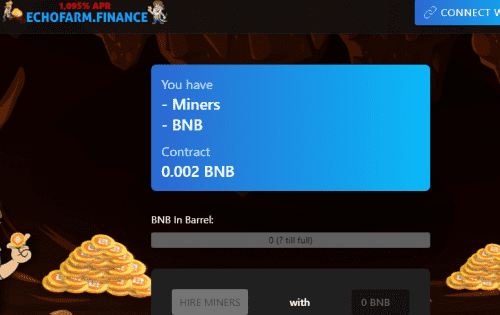

# Echofarm Finance

什么是 Echofarm？
合同
Echofarm 合约经过验证、开源、不可变、无需信任，并且在 BSCScan 上可见。
这一切意味着什么？
这意味着一旦部署了合约，合约就不再需要开发人员来继续按预期运行，对于 Echofarm，甚至不需要网站。每个人都可以阅读/审核并直接与代码交互，并在他们认为合适的时候做出自己的决定。一旦部署了合约，任何人都不能以任何理由停止或更改它，甚至开发人员自己也无权更改或从合约中获取任何东西。
Echofarm 是一个去中心化的工具，它的用户可以完全免费地访问其内部和外部工作，以便他们可以就其对他们意图的有用性做出明智的决定。 Echofarm 社区和/或开发人员执行的所有其他工作纯粹是可选的，不是继续运营所必需的，应被视为慈善社区贡献。
策略与信息
Echofarm 适用于想要长期利润和可持续性的用户。对于那些想要立即获利的人来说，最终会影响他人。
Echofarm 不应与农场混淆。矿工不是被购买的，而是被雇佣的，因此不能被出售。一旦矿工被雇佣，他们就会无限期地为你工作，以每天 3% 的起始费率为你提供无限量的 BNB。

