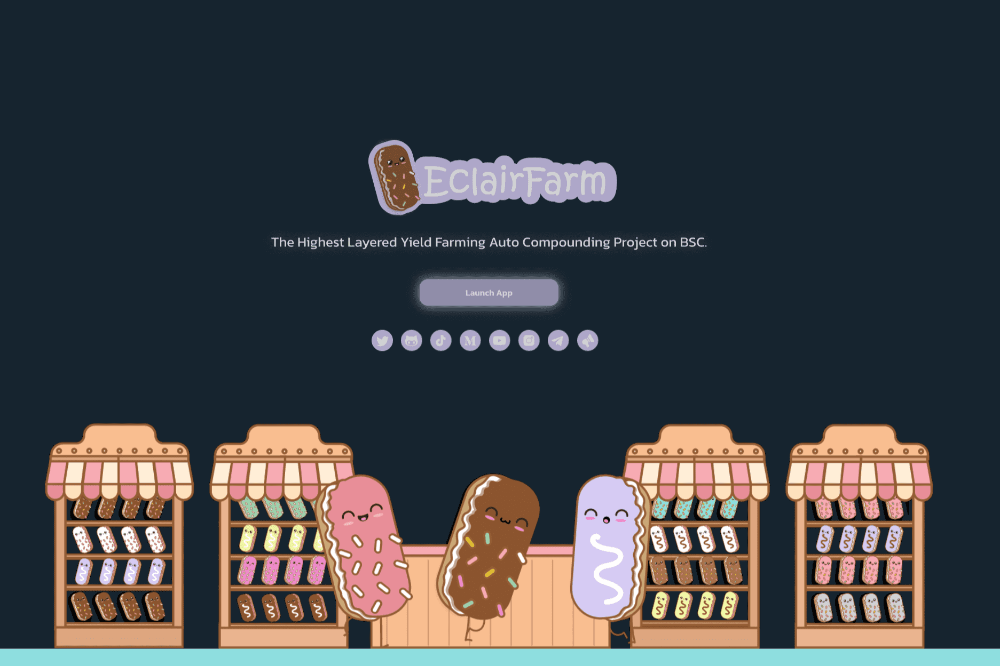

# Eclair Farm

DonutFarm.Finance 是在币安智能链 (BSC) 上获得最高奖励的分层收益农业自动复利项目，为 DONUT 和 ECLAIR 代币的持有者和用户提供收益聚合。为了促进收益农业和复利过程的自动化，DonutFarm .finance 使用保险库（农场和游泳池）。保险库还可以更有效地利用天然气以及其他自动化流程，并使用不同的收益策略来帮助用户通过自动化增加资产。
DonutFarm.finance 有一个最优的复合策略和一个有效的定价模型，旨在鼓励长期的单产农业，并为长期持有者提供适当的激励。由于收益产生和复利过程中的自动化因素，用户无需手动将他们的质押奖励再投资，而是可以通过简单地向非本地 DonutFarm.finance 农场或池存入资金来依靠自动化资产增长。
DONUT 持有者也不需要对支持自动化和收益优化的底层协议有广泛的了解，而将资金存入农场和矿池是一种被动的投资策略。目标是增加用户存入资产的初始价值，类似于加密对冲基金的运作方式，而对用户端的参与最少。

