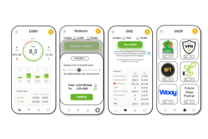

# EcoBytes

挑战：移动运营商每年花费数十亿美元来提高移动互联网质量，以确保我们都拥有令人惊叹的数字体验。然而，尽管有这些改进，但网络容量很快就被以最快的速度吞噬——就像在高速公路（或未来的虚拟世界高速公路）上开辟的新车道一样。
当他们可以收取更多费用但移动 5G 收入一直难以捉摸时，这种模式运作良好。因此，这个永无止境的网络升级周期极大地影响了移动运营商优化成本、提供新的货币化服务以及使更多地方的更多人能够连接或更好地连接。来自关键影响者的一条推文关闭您的移动 Wi-Fi 并最大化您的计划的风险迫在眉睫，这可能会破坏他们的网络。
如果一种新方法可以节省数十亿美元并解决这些挑战，同时奖励客户或他们支持的事业，以有效使用他们的移动数据计划，并且客户可以按照他们想要的方式使用这些奖励？
解决方案：游戏化网络优化
通过让移动消费者参与频谱优化（即，根据需要使用尽可能多的数据，但在 Wi-Fi 可用时不要浪费蜂窝数据），他们可以获得数据红利“EcoBytes”，以有效使用移动数据。
EcoBytes 频谱优化令牌就像移动网络的碳信用。
EcoBytes 最初可以通过群众指导的移动运营商或赞助商慈善捐赠兑换为“Good”（社会事业），最终可以兑换为“Goods”（客户选择的酷东西），因为运营商网络节省通过“成功共享”得到证明/实现基于成本节约的模型。
这是具有强大全球影响力的双赢数据红利！

