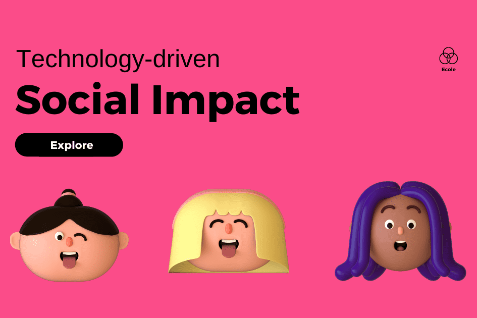

# ECOLE

Ecole 是一个加密货币项目，旨在捐赠部分收益来帮助资助女童的教育。 Ecole 是一个任务驱动的去中心化项目。当许多人为同一个事业一起工作时，伟大的事情就会完成，许多人的生活就会变得更好。高等学校基金会。通过技术赋予年轻女性权力。代币销售的一部分收益用于我们的使命。作为社区成员，您将自动参加比赛、获取更新并与其他成员联系。跟平常使用的纸币需要防伪设计一样，加密货币的防伪是利用数字货币和虚拟货币使用密码学及数字散列而成并与智能合约的绑定之下的新型通证。在2009年成为全世界第一个去中心化的加密货币，这之后加密货币一词多指此类设计。 自此之后数种类似的加密货币被创造，它们通常被称作altcoins。加密货币基于去中心化的共识机制，与依赖中心化监管体系的银行金融系统相对。

