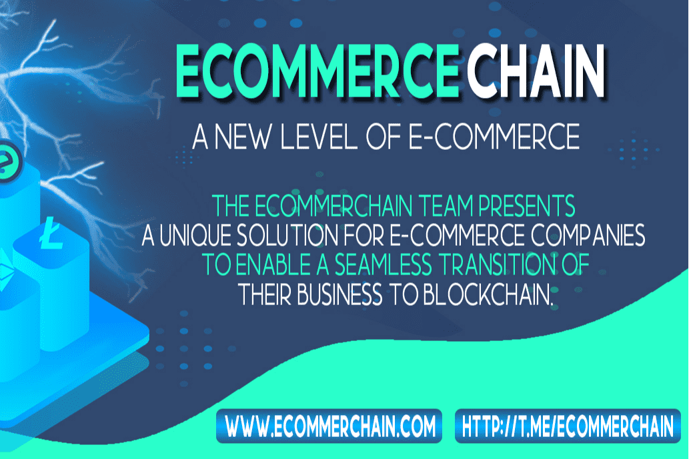

# Ecommer Chain

ECOMMERCHAIN 团队为电子商务公司提供了独特的解决方案，以实现其业务向区块链的无缝过渡。
管理现金流以维持和发展运营是所有商业运营的主要挑战之一，尤其是对于快速发展的电子商务行业。确保安全是更好地进行现金流管理的关键工具。然而，传统方法昂贵且效率低下，每一步都需要昂贵且缓慢的人工干预。
ECOMMERCHAIN 是一个现代化且安全的区块链网络，是开发去中心化电子商务应用程序的最强大的基础设施之一。
加密货币分发
尽管电子商务是加密货币最早和最受欢迎的用途，但其扩散受到剧烈波动、高费用和缓慢的交易速度的阻碍。在大多数国家，消费者要求商品价格以纸币报价。
同时，BTC 和 ETH 网络的高交易费用和缓慢的确认时间使其不适合电子商务支付，尤其是小额支付。充分发挥加密货币在电子商务中的潜力，支持高速交易，佣金极低。
支付解决方案
尽管需求明确，但传统的电子商务网站很难接受加密货币支付。传统的支付处理公司支持一种或两种主要的加密货币，并收取与法定货币之间的高额转换费用。加密货币支付的用户体验也对消费者不利，这使得它们与信用卡等传统支付方式相比缺乏竞争力。
支付网关可以嵌入到任何电子商务网站中，以轻松接受当今市场上几乎任何加密货币的客户付款。

