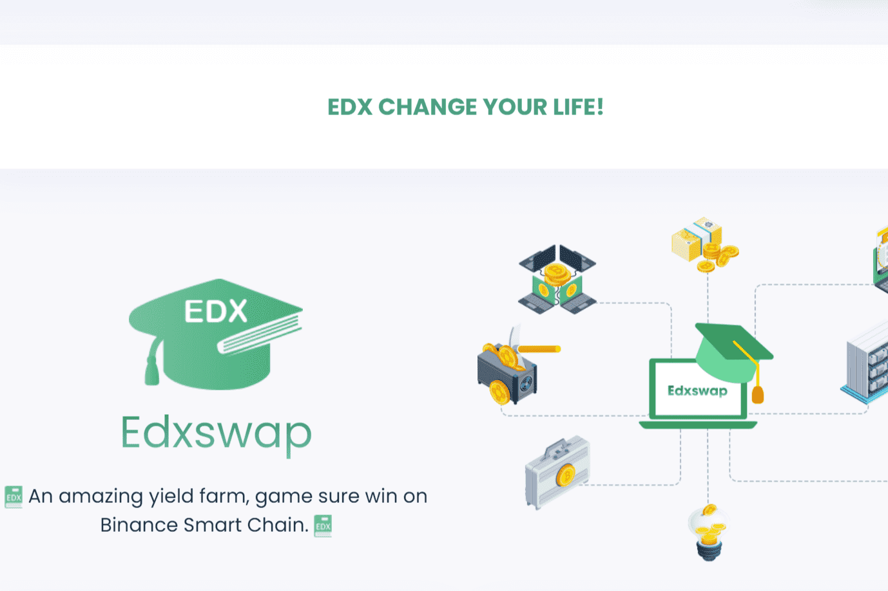

# Education Exchange

Education Exchange 是在币安智能链上运行的去中心化交易所，具有许多其他功能，可让您赚取和赢取代币。它速度快，价格便宜，任何人都可以使用。
特征
贸易
该交易所是一家自动化做市商（“AMM”），允许在币安智能链上交换两种代币。详细信息 门票有 6 种类型，包括：门票 1 美元、门票 5 美元、门票 10 美元、门票 20 美元、门票 50 美元、门票 100 美元每个门票套餐有 3 个选项：10 位玩家、30 位玩家、60 位玩家 购买的所有门票使用 EDX 代币根据当前汇率进行转换。
赚
最重要的是，您可以通过收益农场赚取 BNB，通过 Staking 赚取 BNB，并通过 Syrup 池赚取更多代币。
赢
用 EDX 彩票赢得大奖！

