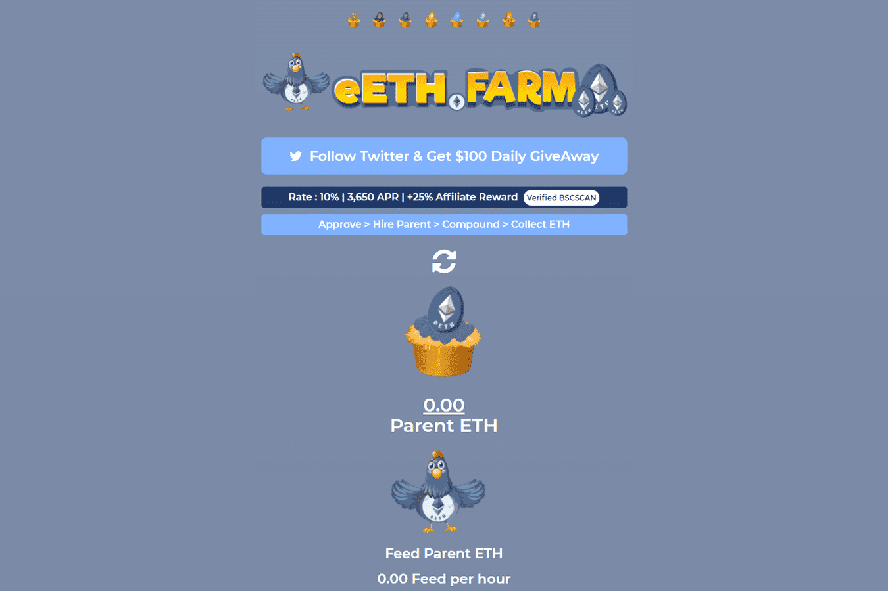

# eETH Farm

聘请父母 ETH 每天赚取 ETH +10%
母 ETH 每天支付适度的 10%，让投资者高枕无忧，因为他们知道他们的投资具有无限的增长潜力和最大值。
可持续性,是一种使用密码学原理来确保交易安全及控制交易单位创造的交易媒介。
母公司 ETH 每天支付 10% 的适度费用，让投资者高枕无忧，因为他们知道他们的投资具有无限的增长潜力和低于 10% 的最大、不可能的风险。eETH Farm 是一个完全去中心化的平台，用户可以在其中赚取 ETH。每日最低投资回报率为 10%

。
