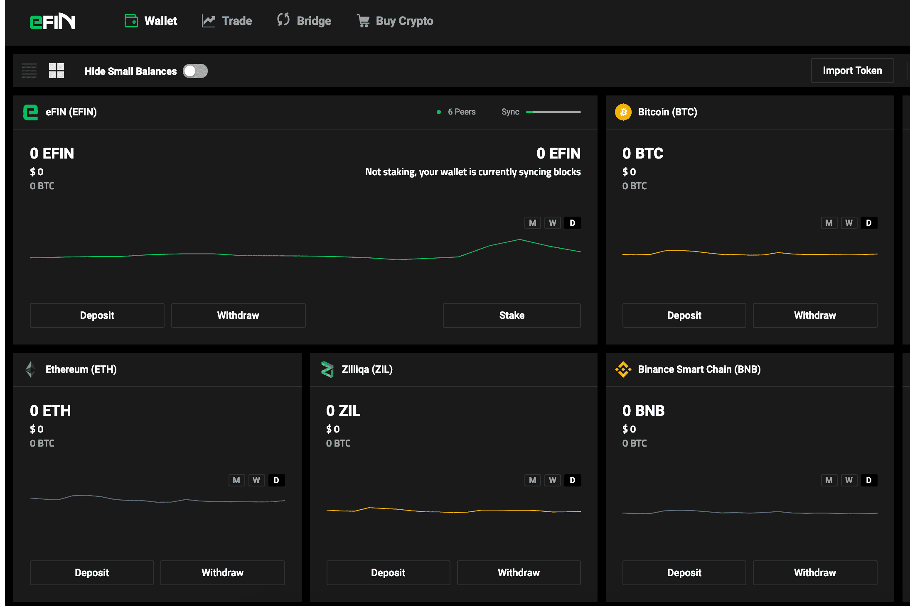

# eFIN Decentralized

eFIN 团队的目标是将旧世界和新世界金融融合在一起。我们正以我们的共同目标、专注驱动、来自传统金融和加密货币数字金融行业的志同道合的合作伙伴的签名网络来实现这一目标，形成一个注定要改写世界金融历史的牢不可破的合作伙伴关系。
WeFIN 是一个安全、点对点、去中心化的交易平台，使用户能够完全控制自己的资产。其多签名引擎采用直观的 UI 界面构建，可确保可扩展且安全的交易。
WeFin Coin 是一种 BEP-20 代币，将充当自己的生态系统，具有多种功能，例如旨在使用户受益的快速、低成本交易。

