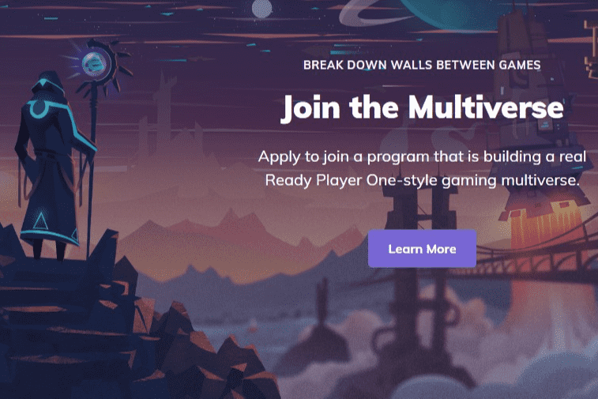

# Efinity

企业和开发人员迫切需要一个能够提供现代、主流和对开发人员友好的 NFT 体验的平台。自以太坊发布以来，人们一直在尝试围绕这个通用计算区块链构建基础设施和代币化，但对更好解决方案的渴望日益增长。创作者被迫面对高昂的费用、不灵活的智能合约和脱节的互操作性。当今 NFT 的采用仍然仅限于顽固的加密爱好者。不可替代代币赖以生存的区块链没有给实际用户任何激励（除了价格上涨），因为矿工获得了所生成代币的全部份额。价格上涨，基础设施公司创建孤岛和付费墙，并且很难在这个行业取得真正的进步 - 除非我们能够统一社区并以不同的方式思考。

