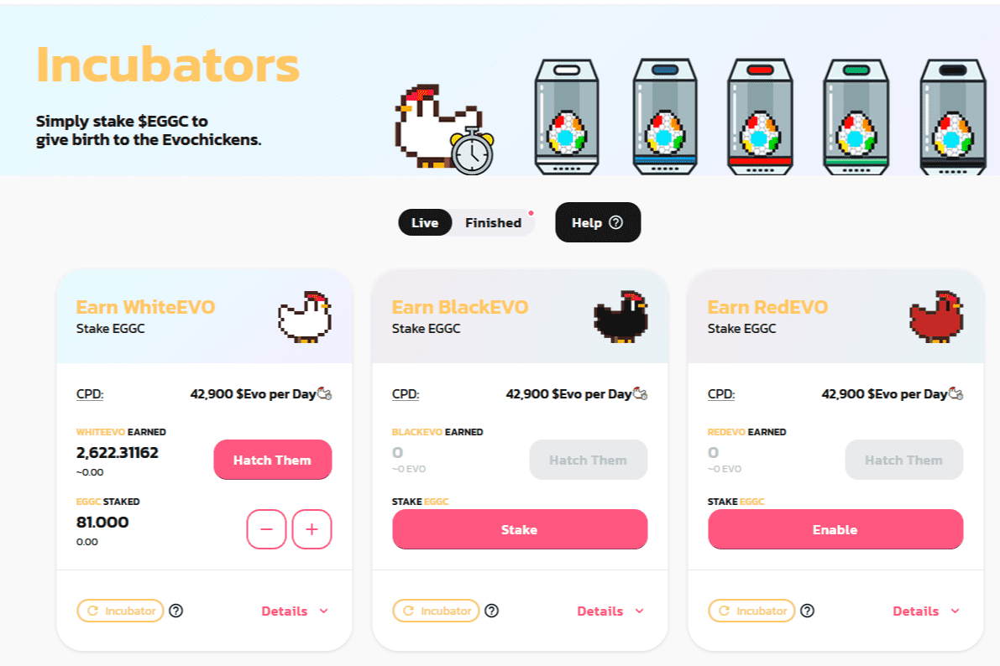

# EggChain Project

EggChain 是第一个进化的 DeFi，您可以在其中种植 NFT。
EggChain 计划成为#BSC 中的教学平台游戏。
该项目是一款类似于 Pokemon 的加密游戏，专注于向新人传授有关区块链的所有知识，包括 DeFi 代币的工作原理以及 NFT 的全部内容。
$EGGC 是 EggChains 的原生代币，可用于孵化 Crypto 鸡。
是的！你听说过 Eggc 代币可以用来从区块链孵化和收集鸡。您只需孵化鸡蛋以孵化不同颜色的鸡代币，然后您就可以将这些鸡进化成更强大的鸡，例如火鸡或叶鸡。然后，您可以使用您的小鸡在小鸡赌场进行比赛/战斗/游戏。将来会有更多的用例。

