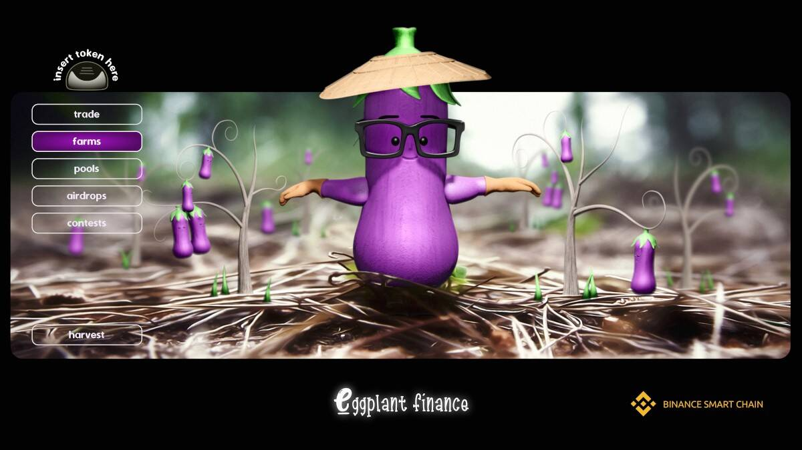

# Eggplant Finance

Eggplant Finance 是运行在币安智能链上的 DeFi 协议，旨在提供创新的收益农业功能和基于代币的游戏/NFT 元素。 Eggplant 平台将提供各种基于代币的迷你游戏、NFT 质押池和市场，以及其他旨在为客户带来最大收益的加密货币组合功能。Eggplant Finance 今日价格为 0.020750728590 美元，24 小时交易量为 95.34 美元。 EGGP 价格在过去 24 小时内下跌 -0.0%。它的流通供应量为 44 万枚 EGGP 币，总供应量为 47.7 万枚。如果您想买卖 Eggplant Finance，PancakeSwap (v2) 是目前最活跃的交易所。

.

