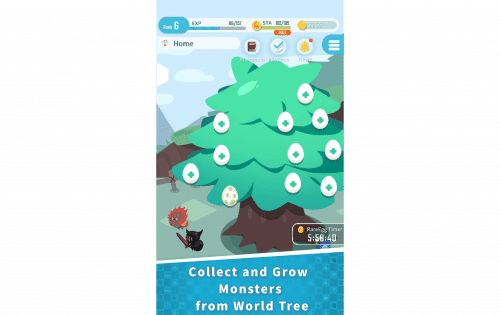

# EGGRYPTO

从世界树孵化和培育怪物！制作最强的怪物收藏！
在世界树保护的神秘世界中，世界树中出现了怪物。收集和训练怪物来建立你自己最强大的团队！

■每天都有机会获得稀有怪物！
您可以通过孵化迷你世界树产生的蛋来获得新的怪物。在极少数情况下，您可以获得称为 Raremon 的稀有怪物。 Raremon 的数量在区块链上是硬性上限且不可变的。

■在Quest中探索EGGRYPTO的冒险！
在 Quest 中，您与怪物组成派对并与敌方怪物战斗。在难度更高的任务中，您可以获得更好的奖励，包括经验、金币和怪物。

■比其他玩家更快地瞄准世界树之巅！
在世界树任务中，玩家根据他们可以爬上世界树的级别进行竞争。

■在Monster Sale 中购买并获得你自己的特殊怪物！
您可以获得非常特别的 NFT Raremons，仅在限量销售中提供。

■ 即将推出！

- PvP 对战：您可以与其他玩家进行对战。
- 新怪物：第 2 季怪物将出现在游戏中
- 
