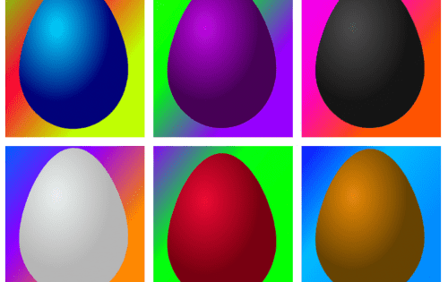

# Eggs on Chain

Eggs on Chain 是链上动态生成的 NFT。鸡蛋生活在区块链上并随着时间的推移而成熟。 NFT 的形象是动态的，随着卵子的成熟而变化。价格也是动态的，每次调用智能合约时，价格都会上涨 10%。它是一种用于生成 NFT 的自包含机制。

Eggs on Chain 是动态的、100% 链上生成的 NFT。
鸡蛋生活在区块链上并随着时间的推移而成熟。
NFT 的形象是动态的，随着卵子的成熟而变化。
价格也是动态的，智能合约上的每次铸币调用，铸币价格都会上涨 10%。
它是一种用于生成 NFT 的新的、独立的机制。

