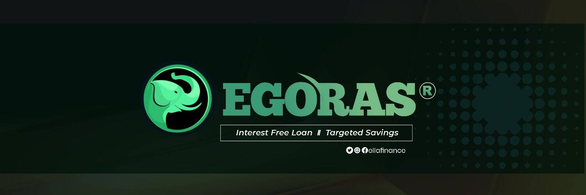

# Egoras

这个怎么运作
Egoras 协议旨在解决小额信贷部门面临的问题，例如高利率、对银行的依赖和负债。 Egoras 协议使用链上金库系统来确保 Egoras 协议不缺乏贷款的资金或流动性，并且这些资金由人民管理。最后，Egoras 协议引入了抵押贷款来解决小额信贷部门的过度负债问题，小企业资产将被转换为不可替代的代币，它代表了抵押品，当借款人拖欠贷款时，这些资产将被出售。
所有贷款都由房地产、车辆和供应链发票等现实世界资产过度抵押。现实世界的资产支持表示为 NFT。
通过在 Egoras 上投票，用户可以支持他们关心的事业并产生影响。

  在 Egoras 借贷协议上连接钱包并锁定 EGR，按类别浏览并找到支持的企业家以获得 ETH 投票奖励。
  EGR 投票者获得两种奖励。首先，他们获得通过通胀货币政策创造的 EGR 投票奖励。其次，他们会收到借款人偿还贷款时产生的 ETH
  EGR 持有人负责管理 Egoras 借贷协议，包括批准和拒绝贷款。治理过程中锁定的 EGR 代币在治理过程结束后 72 小时返还给持有者

