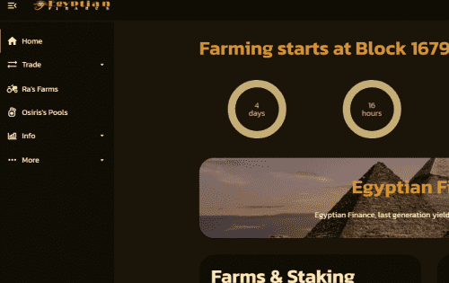

# Egyptian Finance

我们为 Polygon Network 社区带来了一个经典且广为人知的 Yield Farming 项目。我们最初的智能合约基于经典的 MasterChefV2,DeFi 领域正在见证加密领域的指数级增长和普及，越来越多的投资者对其表现出信心和兴趣。其众多原因之一可能是单产农业机会，投资者可以最大限度地提高产量并获得额外收益。

许多流行的 DeFi dApp 都建立在以太坊区块链平台上，如 Metamask 钱包、Uniswap、Compound Finance、Coinbase、MakerDAO 等

