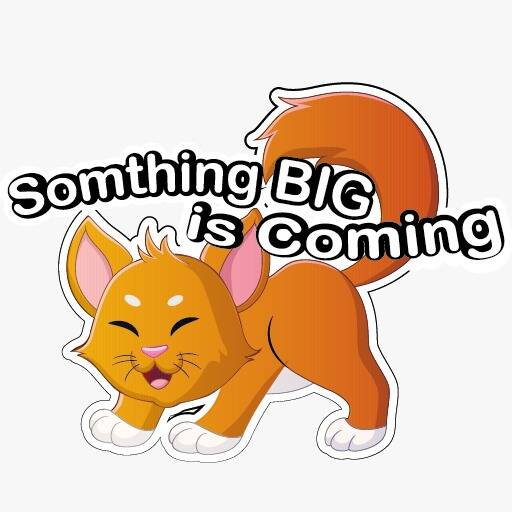

# Egyptian Mau

介绍
Memecoins 目前在加密领域看到了真正的复兴和长期潜力，狗狗币为此铺平了道路。 Egxmau 本质上是一种慈善代币，旨在利用加密和区块链的力量帮助人们改变世界。该项目的开发是为了利用模因的影响来实现这种变化。我们相信金融、经济和政治的未来是去中心化和真正的民主。夺走所谓精英的集权，还给人民。
我们从获救的猫开始
CATS NFT 路线图中最令人兴奋的项目之一是 Rescued Cats NFT。我们将拯救世界各地的猫，并将它们变成美丽的 NFT 的人们可以在区块链上拥有——包括每只获救猫的名字、外貌以及它们来自哪里以及如何获救的故事。猫来了。 Mau Token 旨在成为一种去中心化、社区驱动的加密货币，旨在帮助世界各地的猫收容所和慈善机构。社区驱动的加密货币也意味着我们将拥有一个投票质押系统，人们可以在其中质押他们的 MAU 代币以参与投票来选择我们第一个慈善项目的方向。
埃及 MAU NFT
我们最大的项目是我们的 NFT 市场。我们将允许用户创建和购买/拍卖他们自己的 NFT，并计划允许用户捐赠 % 来帮助拯救猫。

