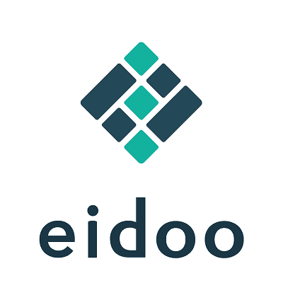

# Eidoo

它声称是一个完全可投诉的非托管钱包，允许用户存储、交换和交易主要的加密资产。 Eidoo 旨在让用户轻松访问一系列 DeFi 服务和工具，包括内置的 Hybrid Exchange 和一个参与和启动符合当地法规的代币销售的平台。 EidooID 是一个合规平台，旨在使公司能够对其项目和众筹业务进行所有必要的验证。这包括 KYC、AML 和 Mifid，并通过他们的钱包将用户的数字身份链接到区块链。
Eidoo 是波塞冬集团的一部分，波塞冬集团是瑞士、意大利和更广泛欧洲的区块链参与者。

