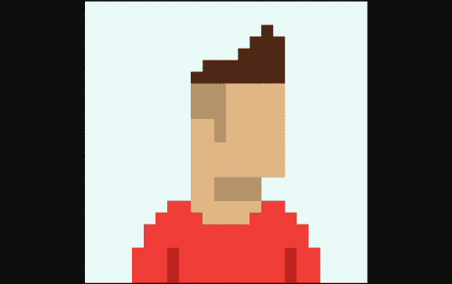

# EightBit Me

EightBit 是由无数 8 位主题特征生成的 8,888 个 NFT 的集合。在该系列中，有稀有的服装、物品和更多惊喜。
每个 NFT 包含一个 PFP 和一个完整的数字八位字符，它们存储在 IPFS 上。所有角色都有自己的页面（参见示例），这些页面将随着时间变得更具交互性。
早在 2010 年，我们就推出了最初的 8 位头像创建器。在朋克和猿人世界之前，我们的应用程序可让您制作自己的虚拟 8 位版本。在此处查看实际情况

