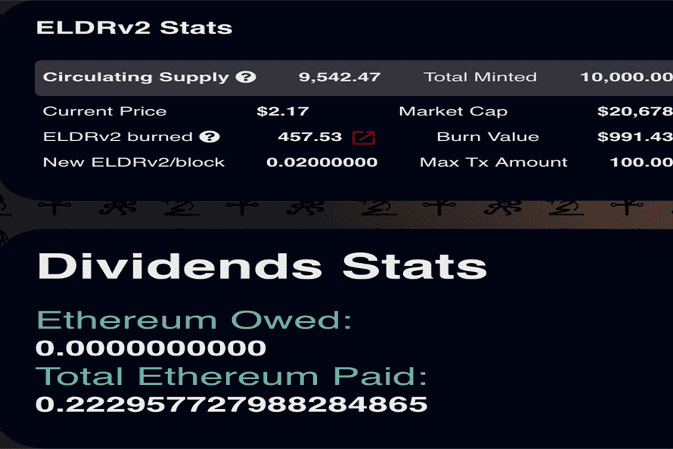

# Eldritch Finance v2

Eldritch Finance -通货紧缩 - Yield Farm - HODL 乘数 - 自动回购 - 以太坊反思 - LP Burn - 更多！
Eldritch Finance v2 是原始代币的重生层。它为 Fantom 上的单产农场提供了前所未有的功能。 5% 的转账费用会产生自动回购、ETH 分红、LP 创建和池分红。出售在合约中累积 FTM，用于购买和销毁代币。 LP 在确保底层的每笔交易中创建。 ETH 被用作支付代币持有者的红利，并且池中的红利被累积用于对 LP 和代币持有者的池奖励。
使用 V1 协议，用户可以参与流动性挖矿获得代币奖励。选择 HODL 而不是收获会导致奖励乘数。用户可以每周收获一次，随时随地。这允许多种策略参与农场，并为用户提供多种获利途径。

