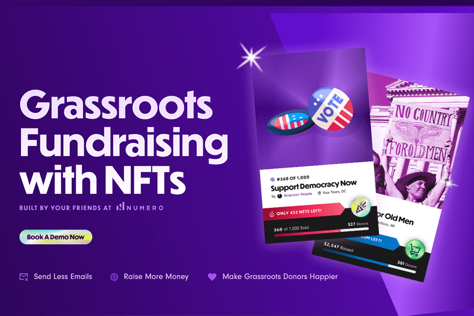

# Electables

Electables.com 通过 NFT 进行草根筹款
Electables 是一个专门为民主党竞选基层筹款而构建的 NFT 平台，符合监管要求。 Electables 由 Numero 背后的团队构建。 Numero 在加密货币和竞选财务监管方面拥有业内最丰富的经验，此前曾建立其首席执行官用于在 2018 年国会竞选期间为任何联邦候选人筹集最多加密货币（250,000 美元）的系统。

  提供奖励，而不是截止日期
  通过向捐赠者提供限量版数字收藏品来筹集更多资金，而不是疯狂的截止日期。
  没有加密，没问题
  捐助者使用他们的信用卡以美元支付，捐款将直接存入您的银行账户。
  吸引新的捐助者
  数字收藏品更有可能被共享。每个 NFT 都带有一个推荐链接，当他们的朋友捐赠时会通知捐赠者。
  粉碎你的筹款目标
  为您的草根支持者举办一场独家活动。邀请 NFT 所有者参加活动

