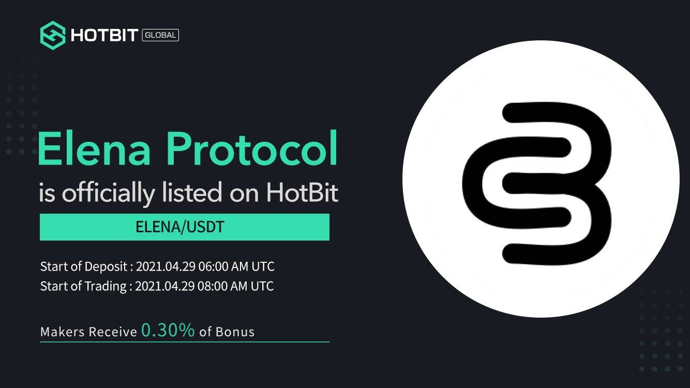

# Elena Protocol

USE 是一种去中心化的算法稳定币。以此为基础，构建新的数字经济市场。 USE 由 Elena 管理，由 Oasis Vault 支持，并且USE & ELENA 持有者可以通过此页面将他们的 USE & ELENA 兑换成 DAI。ELENA 到 USD 的价格是实时更新的。 Elena 协议在过去 24 小时内为 +0%。它的流通供应量为 0 美元。USE 是一种去中心化的算法稳定币。以此为基础，构建新的数字经济市场。 USE 由 Elena 管理，由 Oasis Vault 支持，并由 PCV 协议进行调整。提案 2 已实施。 USE & ELENA 持有者可以通过此页面将他们的 USE & ELENA 兑换成 DAI。ELENA 到 USD 的价格是实时更新的。 Elena 协议在过去 24 小时内为 +0%。它的流通供应量为 0 美元。

