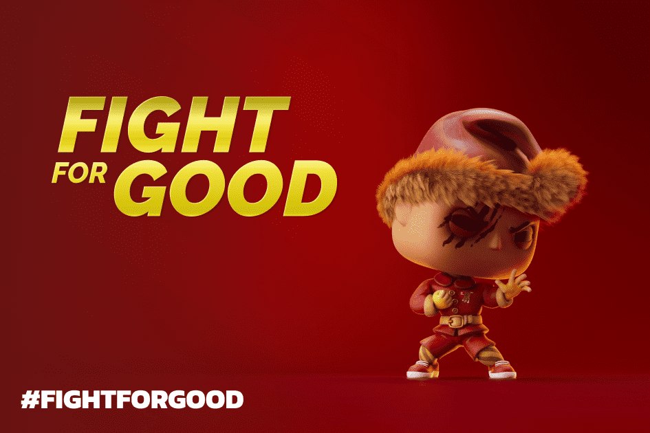

# Elf Fight Club

像大多数游戏一样，EFC 把钱放在你的口袋里。或者更具体地说，它将我们的 DAO 管理的代币 GOOD 放入您的钱包。如何？这很简单！
购买我们的 NFT 以加入竞争激烈的笼子比赛，精灵们在算法生成的战斗中竞争。获胜者将获得比赛池的 80%，并以 GOOD 形式支付。获胜者的支持观众也将获得部分收益（观众甚至不需要拥有 NFT！）。每次战斗，所有 Elf NFT 持有者都会获得 5% 的奖金。换句话说，它是连续的好。
但我们不会止步于此。通过与 EFC 合作，您还可以帮助为慈善捐赠筹集资金。
每年 50% 的销售收入、10% 的比赛奖金和 5% 的 GOOD 升值都会捐赠给 DAO 投票的慈善机构。我们称之为为善而战……明白吗？
立即购买精灵，争取 GOOD 并在 2022 年初给予。
精灵在 OpenSea 上可用。 dApp 建立在 Polygon 和 Unity 之上。游戏流到 Twitch。 GOOD改变生活。
加入#FightForGood！

