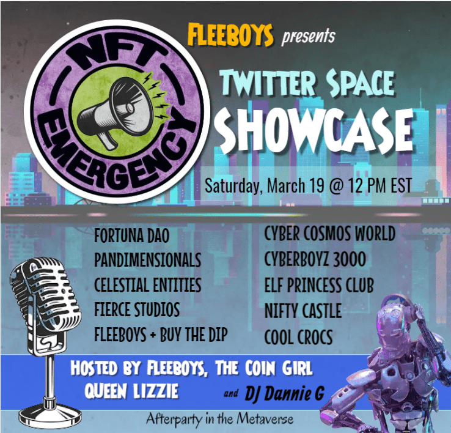

# Elfprincess Club

精灵公主来这里是为了保护和统治元宇宙，他们的数量是 10,000。它们作为 ERC-721 令牌存储在以太坊区块链上并托管在 AWS 上。
每个精灵公主都是由著名的获奖艺术家 Tamanna Jain 创作的独一无二的艺术品。
这些精灵公主奖励您精灵代币，可用于获得每个精灵公主的 3D 模型。这些精灵公主的 3D 模型将用作虚拟世界的商店、游戏和活动中的化身。

精灵公主是统治精灵的人。虽然精灵在美貌、智慧和力量方面优于人类，但精灵公主在美貌、智慧和力量方面几乎超过所有其他人。精灵公主重视自由、多样性和自我表达，她们倾向于混乱中更温和的方面。他们重视和保护他人和自己的自由，而且他们经常是好的。

