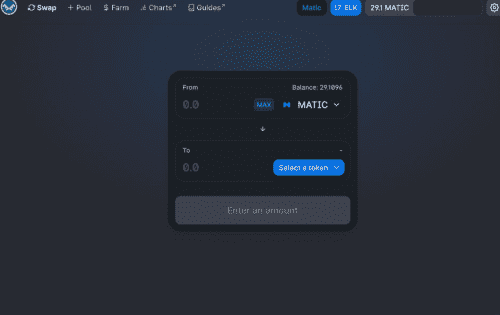

# Elk Finance

麋鹿金融：DeFi 网关。
Elk Finance 是一个用于跨链流动性的去中心化网络。 Elk 生态系统使得跨网络交换加密货币和与智能合约无缝交互成为可能，无需复杂且昂贵的桥梁。麋鹿金融的座右铭是：任何链条，随时随地。
在 Avalanche、Polygon、Fantom、火币生态、xDAI 和 BSC 上直播。

  14 条链上的无常损失保护农业
  实用 NFT
  所有 DEX 费用都归流动性提供者所有
  单一质押
  ElkNet 用于跨链转移，仅用 gas 成本，平均 7 秒即可移动 $ELK 跨链。
  能够将跨链发送到不同的地址
  能够“用 1 $ELK 换天然气”，因此您永远不必担心在您将价值转移到的链上交易有天然气

释放 DeFi 革命的全部潜力。利用 ElkNet 的强大功能，在 6 个最流行的网络上进行即时免费传输。通过全面的金融工具包利用 Elk 的本地流动性。使用 Elk 易于使用的开发者 SDK 部署多链原生 dApp。随时随地探索任何链条。

