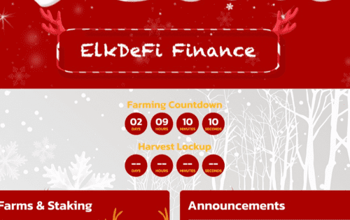

# ElkDeFi Finance

ElkDeFi 是运行在币安智能链上的最新一代 Yield Farm 和 AMM 去中心化交易所，具有许多独特和创造性的功能。我们的灵感来自长期的收获锁定，但我们可以更好地进行收获锁定。ElkNet 实现了跨所有区块链的快速、安全、廉价和无需信任的跨链价值交换。

我们的目标是打破链条之间的障碍，让你不再需要考虑你在哪个链条上。

在减少碎片化的同时提高跨链互操作性是我们愿景的核心。Ellipsis Finance 作为 Curve Finance 的授权分支于 2021 年 3 月正式上线。 Ellipsis 团队将得到 Curve Finance 团队的支持，并将致力于 Curve Finance 的核心价值观：去信任和去中心化的架构、零存款或取款费用、无流动性锁定和极其高效的稳定币交易。在 BNB 链上交易最灵活和资本效率最高的 DEX
在 Curve Finance 的授权分支 Ellipsis.finance 上交换、赚取和提供流动性。

