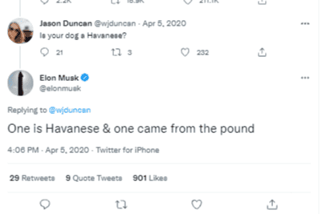

# Elon's Marvin

 Elon's Marvin Token 是基于 Elon Musk 关于他的哈瓦那犬 Marvin 的推文在币安智能链上推出的全新代币。它起源于埃隆马斯克关于他的哈瓦那狗马文的推文，亿万富翁科技企业家多次发布推文。这将是 doge、shib 和 floki 的下一个朋友。Elon's Marvin Token 是基于 Elon Musk 关于他的哈瓦那犬 Marvin 的推文在币安智能链上推出的全新代币。

埃隆的马文本周正在上升。
Elon's Marvin 的价格在过去 7 天内上涨了 10.09%。价格在过去 24 小时内下跌了 64.29%。仅仅过去一个小时，价格就缩水了 1.77%。当前价格为每 MARVIN ₩6.122487。 Elon 的 Marvin 比历史高点₩862.1275 低 99.29%

