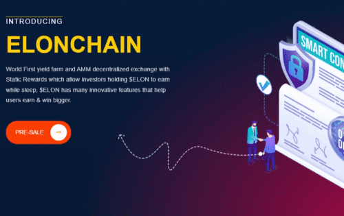

# ElonChain

ELONCHAIN 是一个快速、去中心化的区块链系统，为去中心化金融、NFT 和元界赋能。它安全地连接大多数主流区块链，同时提供极快和低成本的交易。
特别是具有 3 种类型介绍的 ElonChain 快速培养了相当广泛的无缝质量向量和思想共享。方便邀请您的朋友并在他们每次在 ELONCHAIN 上进行交换时赚取一定的佣金奖励，并在 Farms & Launchpools 中获得他们收入的 1%。我们的目的是通过负责任地协调人员、价值、所有权和声誉来帮助创建去中心化的金融系统。 ELON 代币旨在创建一个生态系统，以增加您作为代币的资产价值 建立一个安全可靠的平台，通过质押赚取可观的收入，同时维护其隐私、安全和自主权。我们努力创建一个基于稳健货币政策的生态系统，并具有健全而坚实的去中心化基础，这应该是 ElonChain 平台所期望的。

