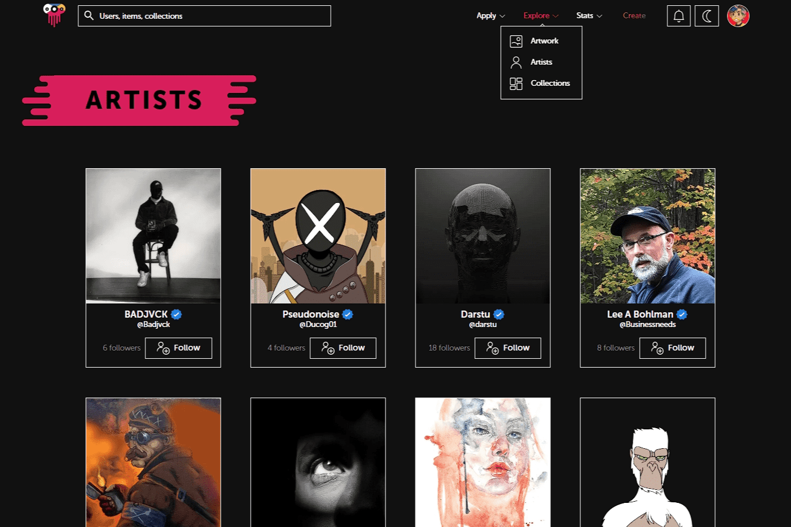

# Endemic

Endemic 是一个新的去中心化 NFT 社交市场，它运行在酷、新鲜和原创的概念上，并为艺术构建更好、更现代的技术。凭借人性化和反企业的态度和个人方法，我们是从 NFT 领域开始的新的和知名的外国和本地艺术家的理想市场。
我们的愿景不仅仅是成为艺术家和收藏家买卖艺术品的地方。是的，您可以期待独一无二的精美且稀有的高艺术 NFT 作品，由世界一流的人才创造性地制作并由我们的策展人精心挑选。与世界上其他市场不同，Endemic 周围的团队蓬勃发展，支持当地艺术家并帮助他们在艺术界留下痕迹。我们希望围绕正确的价值观将人们联系起来，实现社交网络互动，让他们了解 NFT 世界，并鼓励现实生活中的事件和网络。
Endemic 是同类中的第一个 NFT 市场。我们与海洋中的其他物种不同，因为：

  优质策展人精选艺术
  适用于加密领域的社交网络组件
  使用 Aurora 的薄荷和汽油成本低得离谱
  与以太坊和 NEAR 的进一步集成
  Utility Genesis 地方性 NFT
  具有 Defi 功能、实用性和好处的 END 代币
  为游戏、体育和娱乐开辟创新之路
  开启将漫画融入 NFT 领域的创新方式
  与全球组织的合作伙伴关系。

以酷炫的新概念进入 Endemiverse，它将独特的 NFT 实用程序与我们的 Genesis NFT 收藏、游戏、漫画、精美的策展艺术、社交组件、体育和与全球知名组织的合作关系连接起来。

