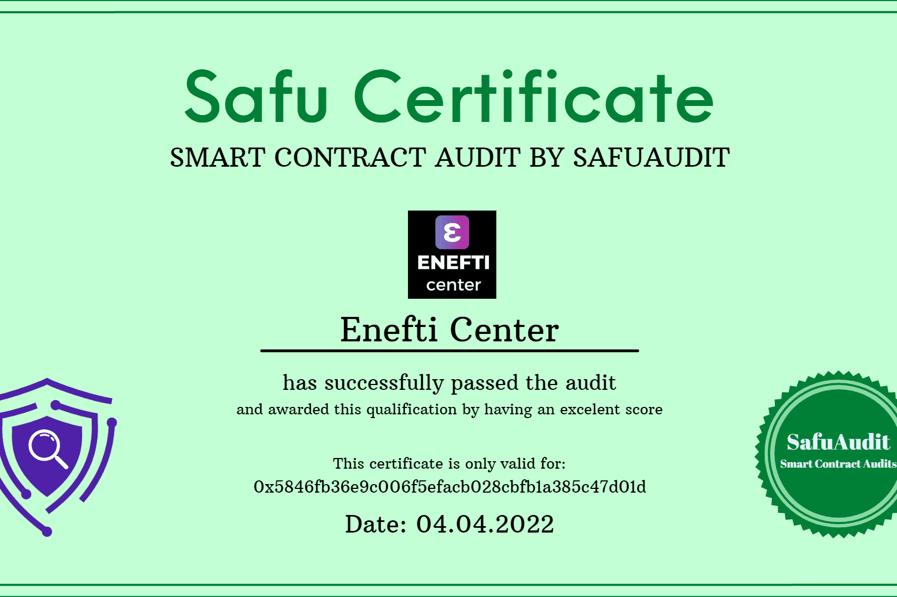

# Enefti Center

我们想用我们的第一封声明信来介绍我们自己和我们的项目。
我叫奥托。我来自比利时。
我目前住在爱沙尼亚/帕尔布市。数字税务系统和公司成立机会非常好。我们成立了一家名为 NFT 技术的官方公司。这就是我选择爱沙尼亚的原因。我的队友在不同的国家。
多年来，我一直在研究加密资产。大约6年。
我积极参与了许多项目。在过去的 2 年中，我参与了 2 个在全球取得成功的项目。
作为 Enefti 中心，我们正在启动一个新项目。我们的目标是成为 NFT 生态系统中的品牌平台。
我们希望让所有内容生产者能够通过单一平台访问所有项目并生产和销售 NFT。
我们为 NFT 爱好者和潜在买家制定了一个伟大的计划。 NFT 项目每天都以数十或数百种新的加密资产的形式出现。其中 99% 都是骗局。
在全球范围内，您只能从 3 或 5 个网站购买可靠的内容。我们的目标是通过单一平台访问所有网站，在 NFT 市场提供积极的使用。
我们将使用 $EFT 作为我们自己的加密货币。在不久的将来，我们将桥接 Polygon — 币安智能链。
我们希望将 NFT 的生产成本和交易税保持在最低水平。
使用 $EFT 作为我们的加密货币，您将能够在不同的加密货币之间进行交换。一段时间后，您将能够通过像您的银行帐户一样抵押来从利息中受益。

