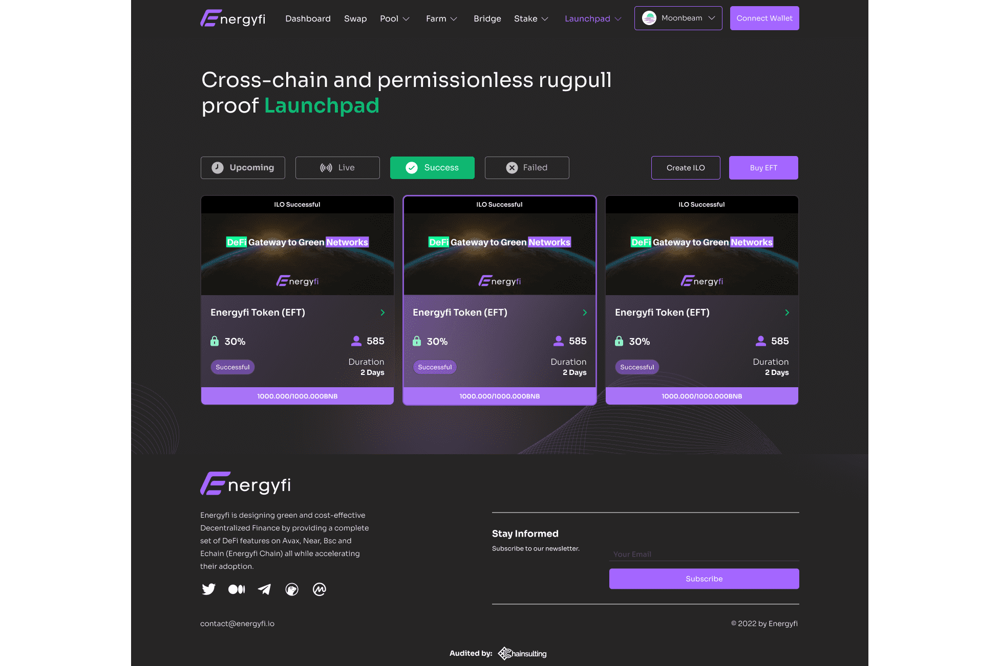

# Energyfi

最近，去中心化金融面临两大问题：高昂的交易成本和过度能源消耗对环境造成的巨大碳足迹。
为了解决这些问题，Energyfi 正在通过在 Moonbeam、Avax、Near、Bsc 和 Echain（Energyfi 链）上提供一整套 DeFi 功能来设计绿色且具有成本效益的去中心化金融，同时加速它们的采用。
Energyfi 平台包括广泛的功能，包括跨链 Launchpad、Bridge、Dex、Staking/Farming 和 Lending。

