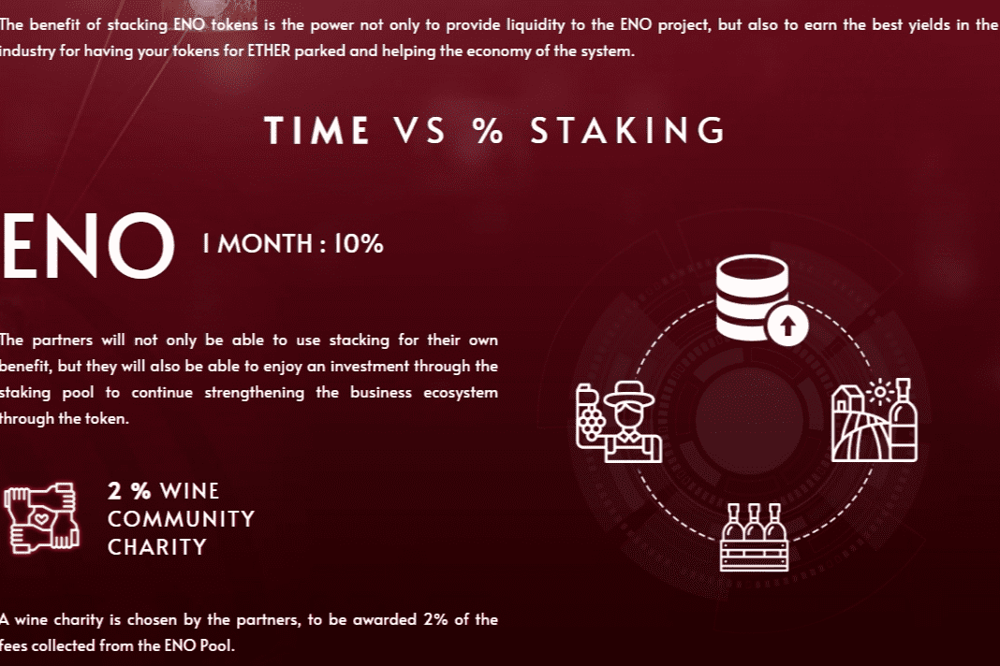

# Enotoken

ENO 是第一个通过区块链通过新的数字葡萄酒革命帮助保护葡萄酒酿造传统的葡萄酒代币，通过新的数据技术保持葡萄酒文化的历史。
ENO 使用区块链技术保证过程、质量、旅程和销售，验证新葡萄酒的培育（Token），特殊和独家瓶子（NFT）的价值，以及只有 ENO 才能提供的独特和不同的体验（NTT）一起。
ENO 致力于通过将来自世界各地的农民、葡萄园、出口商、进口商、消费者、酒店、侍酒师和加密用户聚集在一起，在一个去中心化的社区中统一整个葡萄酒生态系统。

