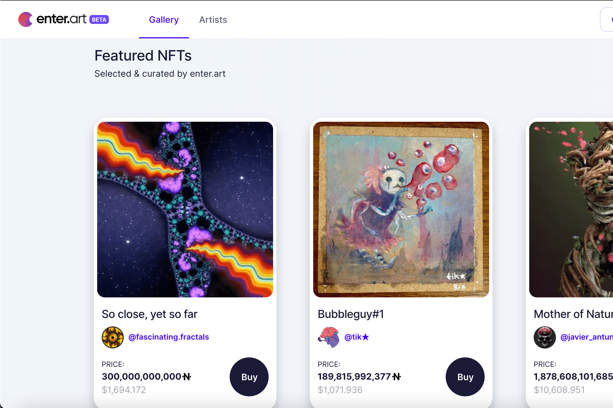

# Enter

NFTART 是 BSC 上的通缩实用代币，为 NFT 生态系统的进入提供动力。代币经济学以被动收入奖励持有者，其中 5% 被重新分配，5% 在区块链上的每笔交易中被烧毁。
NFART 于 2021 年 3 月下旬秘密推出，没有预售。放弃代币的智能合约所有权，所有代码都经过外部审计，以确保投资者的安全。
enter.art 和 enter.audio 是第一个使用 NFTART 作为实用代币的平台，但未来的计划很大而且很远。
在 Enter 平台上，您会发现作为 NFT 艺术家所需的一切免费且轻松的访问功能。您需要考虑的唯一费用是 BSC 交易费用，与其他网络相比，这些费用非常低。您可以为您未来的所有艺术品转售选择高达 20% 的版税，确保您的钱包资产随着您作品的价值而增加。
Enter 提供轻松访问铸币、内置版税拆分、一次铸币多达 20.000 个 NFT 的能力，并且已被确立为币安智能链上视觉 NFT 艺术的首选之地。
该生态系统由挪威加密和科技公司 Enter 构建。团队是公开的。

