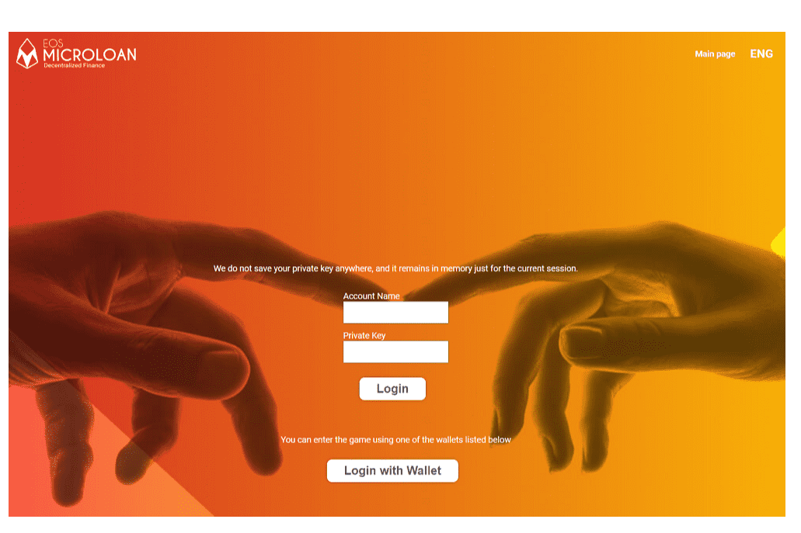

# EOS Microloan

EOS 以速度为基础，旨在奖励其所有者。我们都可以成为 EOS 的所有者，并且在可以想象的各个层面。我会解释。我们都想拥有一栋可以出租的房子，但我们知道这很昂贵，而且很少有人有这样的能力。想象一下，你所能做的就是购买门。 EOS 使您有可能获得红利，即使您能负担得起的只是门。 EOS 让我们能够通过拥有 EOS 代币来租用我们的选票或租用分配给我们的资源。这也不是详细解释该过程的地方，但重要的是要了解它以充分理解下一节。 EOSMicroloan 是每个人都可以拥有的工具，可以通过他们拥有的价值或完成任务的能力来创建贷款。信用卡公司收取 3% 以上的付款，银行收取支票，邮政承运人收取邮票等费用。EOSMicroloan 将收取 1% 的费用，以赋予每个人根据他们协商的条款创建自己的贷款的权利他们的交易对手。啊，我们支付百分之一，这就是问题所在。 1%来自贷款的发起人。借款人不支付任何费用。啊，总有人从我的工作和生意中得到一些东西。是的，不幸的是，这不会改变，但请检查一下！然后，EOSMicroloan 会将 0.5% 的百分比传递给智能合约。没错，收取的 50% 的费用将转移到名为 divmicrofund 的智能合约中。该智能合约将每 24 小时分配 50% 的所有收入流进入基金。这就是 MLT 实用代币的用武之地。根据时间表，每次支付贷款时，付款人和借款人都会获得相同数量的 MLT 代币。然后可以质押这些 MLT 代币，参与者每 24 小时根据 MLT 代币的数量收到 EOS 的分配付款。过去 24 小时内的活动越多，股息支付越大。

