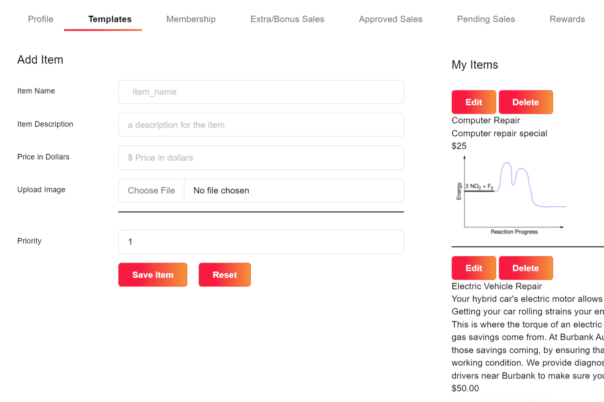

# EOS Template One

我们可以改变我们做生意的方式变得更好。如何？通过使用 EOS 和 EOSIO 创建社区货币系统。
第一步是帮助会员创建数字商店，他们可以在其中列出他们的产品或服务，其中包括完成购买的销售点系统。 EOS 模板一实现了这些目标。
用户界面很简单：每个项目需要完成四个步骤。第一步是提供标题，第二步是描述，第三步是价格，最后一步是上传图片。该模板获取此信息并创建可在 EOS 主网上发布的代码。无需维护服务器，部署到 EOS 主网，无需编码经验，模板将信息转换为可读代码，无需购买域名，唯一 EOS 账户即可。
这个模板还能做什么？它将所有上传的图像和由此产生的购买收据存储到星际文件系统。该系统中的图像便于将来使用。收据可通过链接提供给卖家和买家。

此模板将简化在 EOS 中为想要出售给另一方的任何 EOS 帐户持有人列出待售物品的过程。更重要的是，它降低了普通公民的进入门槛和费用。
为支持姐妹 dapp，对模板的访问将基于每月 5MLT 的会员费。 25% 的 MLT 将转到 burn.mlt。 75% 的 MLT 将用于分红

