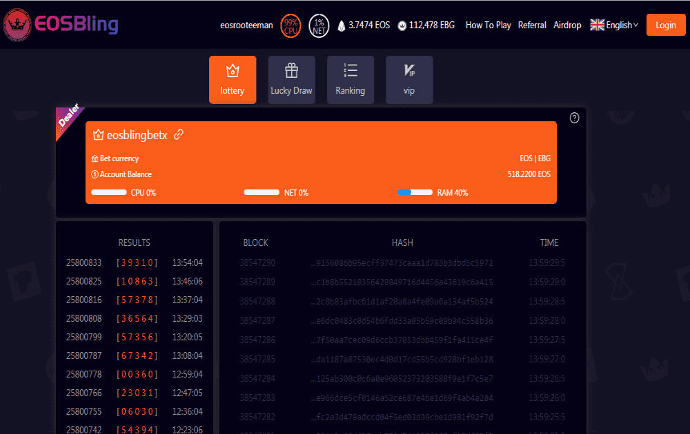

# EOSBling

EOS 彩票让玩家有机会通过投注每个新生成的 EOS 交易哈希生成的数字的结果来赢得巨额奖金。中奖号码是通过我们的彩票软件从最新的交易哈希中获得的，最新的 TxHash 末尾的最后一个数字代表中奖号码。如果最后一位是数字，则认为是有效数字，如果不是，则考虑下一个 TxHash，直到生成所有 5 个数字。 EOS TxHash 是由复杂的加密算法随机生成的 32 位 ID，通常显示为十六进制值。我们的绘图过程利用这种真正随机的计算过程来确保其公平性和透明度。

