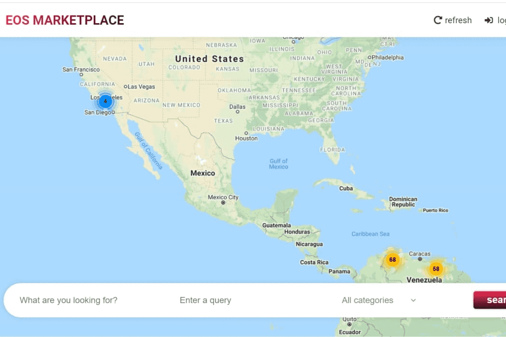

# EOSMARKETPLACE

EOSMARKETPLACE 是一个平台，潜在的企业或个人可以在其中拥有基于地理位置的广告列表。为了能够上市，企业或个人必须首先注册他们的企业。这是通过提供企业名称、徽标、电子邮件地址和企业的实际地址来完成的。为了在地图上做广告，每月花费 5 MLT。 MLT可以通过使用DAPP EOSMICROLOAN获得。每个企业最多只能在其企业列表中宣传 3 种产品，这些产品将与用于登录和创建列表的 EOS 帐户相关联。当销售特价产品时，同一个 EOS 账户将收到客户支付的款项。客户必须首先使用 EOS 帐户登录 EOSMARKETPLACE，并通过提供电子邮件来完成他们的个人资料。这就对了！然后，客户可以单击企业列表，并选择他或她想要购买的产品。然后将通知卖方有待处理的销售。为了使交易成为最终交易，卖方必须批准出售。一旦销售被卖家批准，就会使用 EOSMICROLOAN 创建小额贷款。 EOSMARKETPLACE 还有另一个组件，那就是主页上的横幅。为了在主页上获得优质的广告位，必须支付 MLT。最多有 6 个位置，企业通过拍卖/投标系统竞争这些位置。支付最多 MLT 的企业将获得第一名，支付第二多的企业将获得第二名，依此类推。如果外部企业的出价高于当前拥有横幅的企业，则将从列表中删除最低 MLT 金额。这确保了支付的 6 个最高金额有横幅。但是，广告中的 MLT 功率每 24 小时衰减 3%。这意味着，如果您支付 30 MLT 来获得横幅，24 小时后将只有 29 MLT 记入您的横幅广告位。
