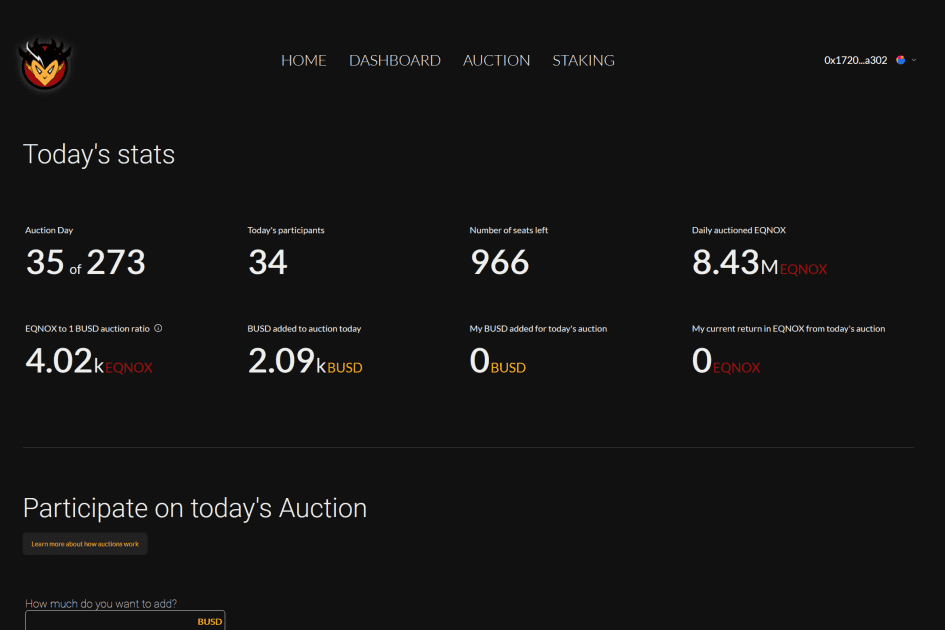

# EQNOX

EQNOX 是一个不可变的智能合约，没有任何所有者，不能被审查或停止。它是一种通胀质押代币，每天通过利息将通胀分配给活跃质押。通货膨胀从每天 1.8% 开始，随着季节的变化而下降，直到在 7 年的持续下降之后稳定在每年 4%。在前 273 个期间，EQNOX 代币将通过每日拍卖每天铸造和分发。这些拍卖将为代币提供基础流动性。
EQNOX 内置了一个自动做市商，用于在 EQNOX-BUSD 货币对上创建和发展流动资金池。通过每日拍卖收集的所有 BUSD 中几乎有一半将用于扩大流动性池，剩下的一半将通过每日随机奖励返还给拍卖参与者。
EQNOX 内置强大的推荐系统，旨在吸引拥有大量追随者的影响者。每次用户使用推荐链接与 EQNOX 交互时，提供推荐的人将获得用户投入合约的 BUSD 的 10%。此外，推荐具有粘性，这意味着推荐的提供者将继续赚取其他用户投入合同的所有费用的 10%，直到用户故意将其推荐更改为另一个地址。这是非常强大的，因为您可能会永远获得使用您推荐链接的每个人的 10%。
EQNOX 是第一个与季节一致的代币，一年中的某一天和当前季节直接影响赌注的运作方式。收获季节，从 10 月到 12 月，是最重要的季节。赌注可以永远持续下去，并且只能在 10 月至 12 月的收获季节结束而不会受到处罚。这是一个关于将未来的兴趣从纸手送给钻石手的年度庆祝活动。

